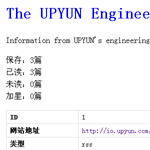
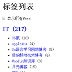
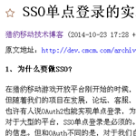
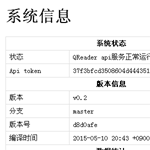
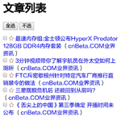

QReader - a browser-server based feed reader
====================================================

QReader 是一款使用 Go 和 JavaScript 编写的阅读器，支持订阅 RSS 2.0 和 Atom 1.0 格式的 feed。Github地址：<https://github.com/m3ng9i/qreader>。

为了运行 QReader ，你需要有一台 server，它可以是你放在局域网中的 PC。你需要在 server 上运行 QReader 服务端程序，然后使用手机、平板电脑或 server 上的浏览器访问 QReader。当然，如果你有兴趣，可以尝试把 QReader 编译到 Android、iOS 设备或路由器中。

QReader 是一个单用户的阅读器，不适合多人共同使用。

[直接下载 QReader 可执行程序](https://github.com/m3ng9i/qreader/releases)。

## 0. 功能

QReader 包含如下功能：

- 按照标签分类 feed
- 为每个 feed 单独设置更新周期
- 设置最大已读保留数，当某个 feed 的未读文章数量超过设定的值后，较早的未读文章会被自动标记为已读
- 设置最大文章保留数，当某个 feed 的已读文章数量超过设定的值后，较早的已读文章会被自动删除
- 可以按随机顺序显示抓取的文章条目
- 设置每页显示的条目数量
- 文章加星
- 设置登录密码
- 与 QReader 服务器通讯的数据可以开启 TLS 加密
- 支持使用 Socks5 代理服务器抓取 feed

## 1. 截图

下面是 PC 和手机上的 QReader 界面截图，点击可查看大图。

Windows, Google Chrome：

Android, Opera：

## 2. 安装与运行

QReader 程序分为服务器端与客户端两部分。服务器端负责抓取 feed 并提供 http 服务。客户端需要通过浏览器访问，用来阅读与管理 feed。建议将 QReader 服务器安装在 PC 或 Mac 上，然后使用电脑、手机或平板上的浏览器访问 QReader 客户端。

除了[直接下载](https://github.com/m3ng9i/qreader/releases)已编译好的可执行程序外，你也可以根据下面的说明自行编译 QReader。

### 2.1 编译

在命令行界面中运行以下命令下载并编译程序：

    go get -d github.com/m3ng9i/qreader
    cd `echo $GOPATH | cut -d ":" -f 1 | cut -d ";" -f 1`/src/github.com/m3ng9i/qreader
    chmod u+x build.py
    ./build.py

上述命令可以在 Mac/Linux 的命令行界面或 Windows 的 Cygwin 下运行。其中 `./build.py` 负责具体的编译工作，需要用到 python3，如果你没有安装 python3，也可以使用 `go build` 命令代替，但生成的可执行程序中将不会包含程序版本信息。

编译完成后会在当前目录（QReader 源码目录）下生成一个可执行文件，Windows 下为 qreader.exe，Mac/Linux 下为 qreader。编译完成后，除了刚编译好的可执行程序以及 `sitedata` 目录外，其他文件均不再需要，可以删除。

如果你想图省事，也可以使用下面的命令完成源码下载和编译：

    go get github.com/m3ng9i/qreader

使用此命令生成的可执行程序将会在 $GOPATH/bin 目录下生成，同样不会包含程序版本信息。

由于 QReader 使用的 SQLite3 数据库驱动 (github.com/mattn/go-sqlite3) 基于 cgo，因此无法实现跨平台编译。

如果在 Windows 下编译 go-sqlite3 时遇到问题，建议使用 [TDM-GCC](http://tdm-gcc.tdragon.net) 进行编译。

### 2.2 sitedata 目录

`sitedata` 目录保存着配置文件、客户端程序（JavaScript、HTML、CSS文件）、数据库文件和用来进行 TLS 加密的证书。QReader运行时需要读取 sitedata 目录下的文件。

### 2.3 配置文件

`sitedata/config.ini` 是 QReader的配置文件，在对 QReader 初始化后会自动生成此文件。你也可以使用 QReader 的命令行参数 `-defini` 显示默认的配置文件内容。配置文件中各字段的说明如下：

- ip：QReader 服务器绑定的IP，如果只允许本机访问，可以设置为 127.0.0.1；如果需要让局域网内的其他设备访问 QReader，请设置为局域网 IP；如果要允许来自任意 IP 的设备访问 QReader，请设置为 0.0.0.0（可能存在安全风险，因此不推荐这样做）；如果设置为 auto，系统将自动设置绑定 IP，绑定的 IP 可能是局域网 IP 或公网 IP，或 127.0.0.1。

- port：QReader 服务器绑定的端口号。

- usetls：是否使用 TLS 加密 QReader 服务器端与客户端之间的通信。开启加密后，需要用 https 开头的 url 访问 QReader。

- logfile：日志文件路径，如果为空，日志将输出到 stdout。

- loglevel：日志级别，默认值为 INFO，可选值为 DEBUG、NOTICE、INFO、WARN、ERROR、FATAL。

- permission：创建日志文件和 config.ini 时的权限，默认为 640。

- password：登录至 QReader 的密码，如不需要密码，留空即可。

- salt：在进行 hash 时使用的 salt，必须与 sitedata/client/include/qreader.auth.js 中的 QReader.salt 变量值保持一致。一般无需修改，使用默认值即可。

- debug：是否开启 debug，开启后将会输出更多的日志。

- proxy：Socks5 代理服务器 IP 和端口，例如 127.0.0.1:8080。如果没有请留空。

- proxy_username：Socks5 代理服务器用户名，如果没有请留空。

- proxy_password：Socks5 代理服务器密码，如果没有请留空。

- use_proxy：使用代理服务器的规则。always：总是使用代理服务器获取 feed。try：在获取 feed 失败后，尝试使用代理服务器再次获取 feed。never：不使用代理服务器获取 feed。

注意：修改了配置文件后，需要重新启动 QReader 才能生效。

### 2.4 初始化

你可以将 QReader 可执行程序和 sitedata 目录放到任意目录下。如果 sitedata 目录与 QReader 可执行程序不在同一个父目录下，在运行时，需要用 `-s` 参数指定 sitedata 目录的位置。

首次运行前需要初始化，用以生成数据库文件和配置文件。进入 QReader 可执行程序所在目录，然后执行：

    ./qreader -init

或

    ./qreader -s <sitedata 所在路径> -init

然后输入 `y` 回车，会在 sitedata 目录下生成配置文件 config.ini 和 数据库文件 feed.db。如果多次进行初始化，新生成的 config.ini 和 feed.db 会覆盖已存在的文件。

你可以根据需要，修改配置文件中的部分配置。之后就可以运行了。

### 2.5 运行

完成初始化后，运行：

    ./qreader

或

    ./qreader -s <sitedata 所在路径>

启动 QReader 服务器。默认会将日志输出到 stdout，你可以在日志中看到 QReader 的访问地址。如果你需要同时在系统默认浏览器中打开 QReader 页面，可以加上 `-open` 参数。

使用浏览器打开 QReader 网页，如果你没有在配置文件中设置密码，直接在登录界面点击“登录”即可。登录后，点击“订阅”，添加 feed。

### 2.6 命令行参数

完整的命令行参数说明：

    -s, -sitedata <sitedata>    指定 sitedata 路径，如果没有提供，使用当前目录下的 sitedata 目录
    -init                       初始化 QReader 数据库和 config.ini 文件
    -initdb                     初始化 QReader 数据库
    -current-token              显示当前的 api token
    -defini                     显示默认的 config.ini 文件内容
    -open                       运行 QReader 服务器的同时，使用系统默认浏览器打开 QReader 网页
    -h, -help                   显示帮助
    -v, -version                显示版本信息

### 2.7 关闭 QReader 服务器

关闭 QReader 服务器有多种方法：

- 通过 QReader 网页客户端关闭：点击“系统”→“关闭 QReader 服务器”按钮，确认后 QReader 服务器就被关闭了。
- 打开之前运行 QReader 的命令行窗口，按 `ctrl+c` 结束 QReader 进程。
- 使用命令行关闭：在 Mac/Linux 或 Windows 的 Cygwin 命令行窗口中，输入 `kill PID` 回车，其中 PID 指 QReader 的 Process ID。
- 使用操作系统自带的进程管理工具关闭：例如 Windows 的“任务管理器”、Ubuntu 的“系统监视器”、Mac 的“活动监视器”。

### 2.8 浏览器支持

QReader 使用网页作为客户端用户界面，建议使用的浏览器为 Google Chrome、Mozilla Firefox、Safari 或 Opera。在 IE 下可能无法正常使用。你也可以通过手机或平板电脑上的浏览器访问 QReader。

QReader 支持如下的快捷键：

快捷键                          | 说明
------------------------------- | -------------
0 或 h                          | 前往首页
r                               | 刷新页面
t                               | 页面顶部
b                               | 页面底部
ctrl+left, command+left 或 p    | 上一页
ctrl+right, command+right 或 n  | 下一页

## 3. 技术规格

- 开发语言：Go、JavaScript
- 数据库：SQLite3

第三方模块（JavaScript/CSS）：

- WebApp：[AngularJS](https://angularjs.org)
- JS library：[jQuery](http://jquery.com)
- 摘要算法：[Forge](https://github.com/digitalbazaar/forge)
- 快捷键：[Mousetrap](https://craig.is/killing/mice)
- Icons：[Font Awesome](http://fontawesome.io)
- Normalizes CSS：[normalize.css](https://github.com/necolas/normalize.css)

第三方模块（Go）：

- Web 服务：[Martini](https://github.com/go-martini/martini)
- ORM：[Xorm](https://github.com/go-xorm/xorm)
- SQLite3 驱动：[go-sqlite3](https://github.com/mattn/go-sqlite3)
- HTML 过滤：[bluemonday](https://github.com/microcosm-cc/bluemonday)
- 配置文件读取：[goconfig](https://github.com/Unknwon/goconfig)
- 开启浏览器：[Webbrowser](https://github.com/toqueteos/webbrowser)

以下 Go 模块来自我写的 feedreader 和 go-utils 包：

- RSS 和 Atom 解析：[feedreader](https://github.com/m3ng9i/feedreader)
- Go 工具包：[go-utils](https://github.com/m3ng9i/go-utils)
